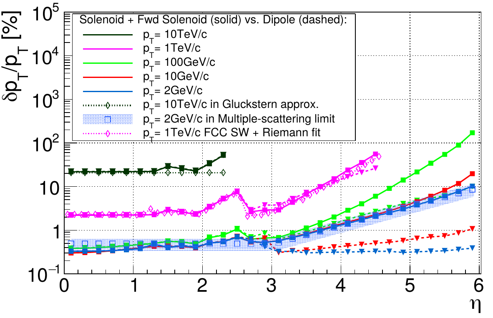
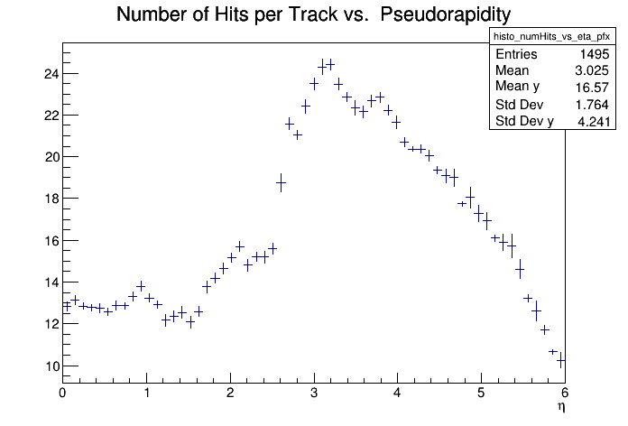
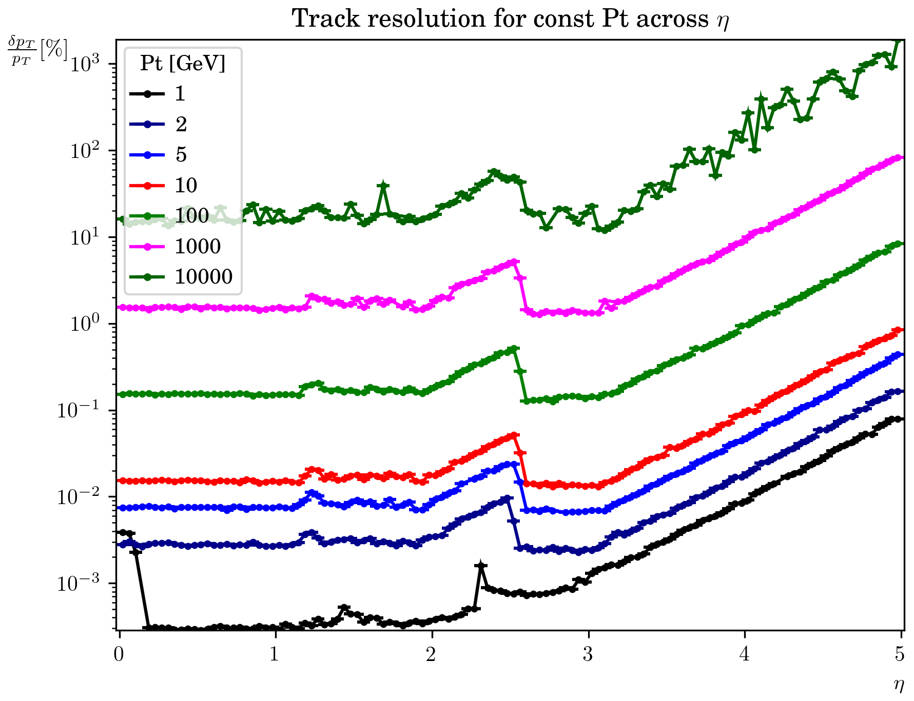

# Reana example - FCC-hh Full Simulation Tracker Performance study

This example reproduces one curve of figure 7.12 from the Conceptual Design Report (CDR) of the
hadronic Future Circular Collider (FCC-hh) <http://cds.cern.ch/record/2651300> .

 

Fig. 7.12 compares the momentum resolution of the proposed track detector model for two magnet
options. The resolution is calculated using different approximations.
Here we reproduce the full simulation result that simulates single muons in Geant4 and fits them
using the Riemann fit, all using the FCC software framework FCCSW.

The first step is the full detector simulation of single muons. This should take around 30 mins on a
machine with at least 4GB of RAM. The output root file contains information on the original particles and
the corresponding tracker hits in the FCC event data model. We can inspect the number of hits per
track with the script `'numHitsPerTrack.C("muons_for_seeding_discrete_pt.root")'`, for example.

 

The final step is fitting the tracker hits with a Riemann fit, implemented in the `tricktrack`
seeding library, which is again integrated in the FCC Framework. This yields the reconstructed
tracks, which can be plotted with the python script `plot_single_particle_resolutions.py`:

 

The pink curve corresponds to the one in figure 7.12.
While the Riemann Fit cannot correctly estimate the resolutions for low momentum tracks, whose
errors are dominated by scattering, the agreement of the high momentum tracks with the analytical
methods is good. 
